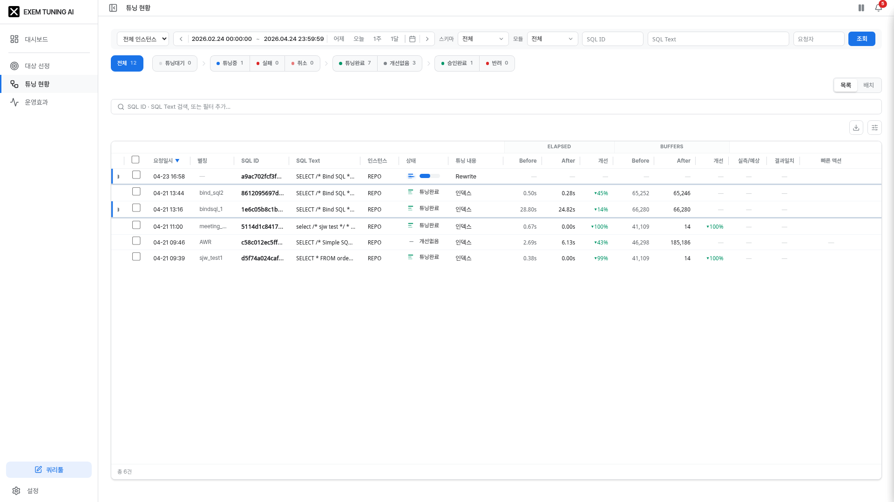
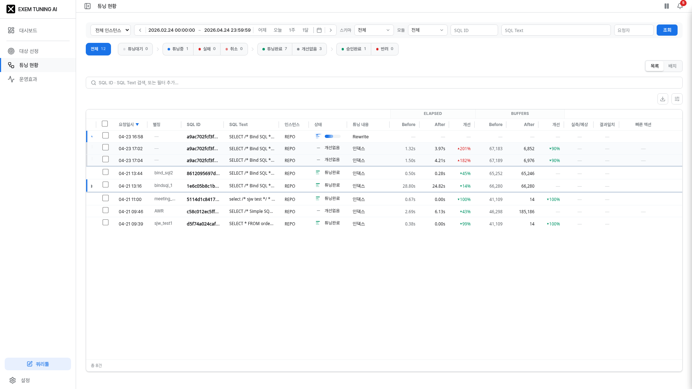
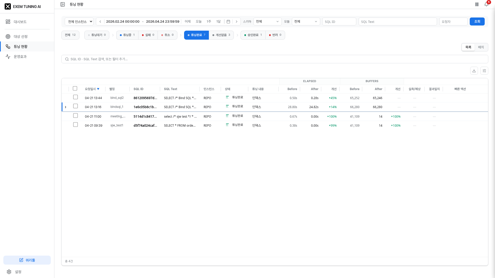
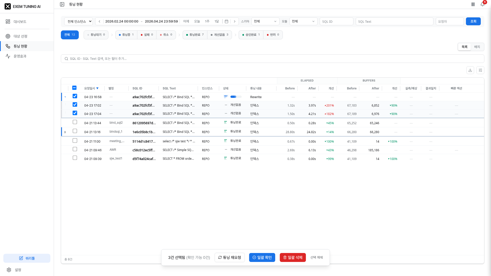
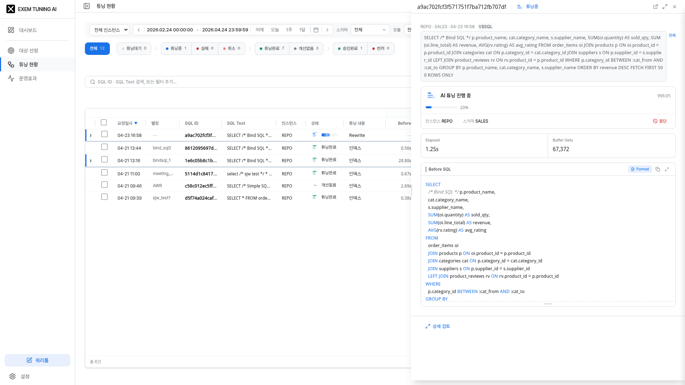
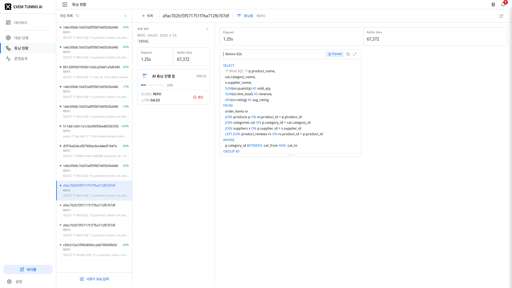
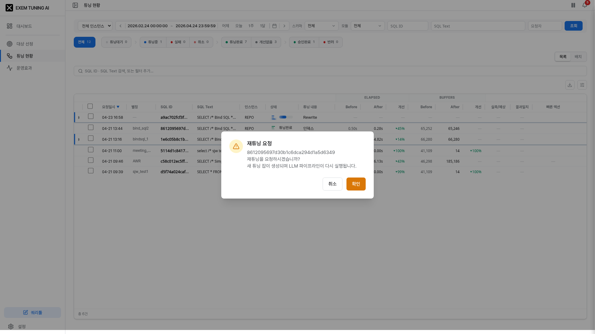

# 튜닝현황 화면 기획 명세서 v1

**작성**: 2026-04-24 · **대상**: 10.10.45.119:3005 · **뷰포트**: 1920×1080

튜닝현황 기능의 주요 화면·상태를 화면 캡처 기반으로 설명한다. 각 섹션은 "화면 이미지 → 구성 요소 설명 → 동작" 순으로 서술하며, 세부 로직·데이터 계약은 동일 폴더의 `spec-backend-*.md` / `spec-frontend-*.md` 를 참조.

---

## 목차

1. [목록 — 기본 화면](#1-목록--기본-화면)
2. [목록 — 재튜닝 트리 펼침](#2-목록--재튜닝-트리-펼침)
3. [목록 — 상태 필터 적용](#3-목록--상태-필터-적용)
4. [목록 — 그룹 체크 + 플로팅 액션 바](#4-목록--그룹-체크--플로팅-액션-바)
5. [슬라이드 패널 — 검토](#5-슬라이드-패널--검토)
6. [슬라이드 패널 — 워크스페이스 상세](#6-슬라이드-패널--워크스페이스-상세)
7. [워크스페이스 모드 (T2)](#7-워크스페이스-모드-t2)
8. [워크스페이스 — SQL/Plan 비교](#8-워크스페이스--sqlplan-비교)
9. [재튜닝 요청 다이얼로그](#9-재튜닝-요청-다이얼로그)
10. [개선률 뱃지 시각 규격](#10-개선률-뱃지-시각-규격)

---

## 1. 목록 — 기본 화면



**화면 목적**: AI 튜닝 요청의 전체 현황을 중앙 작업함 형태로 조회. 상태·필터·정렬을 통해 이상 항목을 빠르게 식별.

**주요 구성 요소**

| 영역 | 설명 |
|------|------|
| 상단 조회조건 바 | 기간 · 인스턴스 · 스키마 · 모듈 다중선택 + 조회 버튼 |
| 상태 파이프라인 pill | 전체 / 튜닝대기 / 튜닝중 / 실패 / 취소 / 튜닝완료 / 개선없음 / 승인완료 / 반려 — 색상 점 + 건수 |
| 속성 필터 칩 | 자유검색 + 드롭다운 속성(상태·유형·출처·실행검증·정합성·요청자) |
| 작업 테이블 | 체크박스 · 요청일시 · SQL ID · SQL 텍스트 · 상태 · 튜닝내용 · Elapsed(Before/After/개선) · Buffers(Before/After/개선) · 실측/예상 · 결과일치 |

**동작**
- 기본 정렬: 요청일시 DESC (최신 상단)
- 같은 SQL 의 여러 요청은 **트리로 묶여 루트(최초)만 표시** (`▶N` 자식 수 뱃지)
- 상태 필터 pill 클릭 시 즉시 목록 필터링

---

## 2. 목록 — 재튜닝 트리 펼침



**화면 목적**: 재튜닝 체인의 시간 순서를 한눈에 확인. 원본 요청과 재튜닝 건을 하나의 그룹으로 묶어 이력 추적.

**주요 구성 요소**

| 요소 | 시각 스타일 |
|------|------------|
| 루트 행 (자식 있음) | 좌측 `border-l-[3px] border-action` (파란 inset) + `▶` 토글 버튼 + 자식 수 뱃지 |
| 자식 행 | 좌측 `border-l-[3px] border-slate-300` (회색 inset) + `└` 커넥터 + `bg-slate-50/80` 배경 + 들여쓰기 |
| 그룹 마지막 행 | `border-b-[3px] border-b-slate-300` (일반의 3배 두께, slate-300 진한 색) |
| 일반 행 (단독) | inset 없음 · 기본 border-b 1px |

**동작**
- `▶` 클릭 시 해당 그룹의 자식 펼침 (React fiber onChange 발화로 제어)
- 초기 렌더는 **자식 숨김** 상태 (루트만)
- 그룹 키: `asis_sql_id + instance_id`
- 그룹 내 정렬: 오래된 것(root) → 최신(자식 시간순)
- 그룹 간 정렬: 그룹의 최신 요청 시각 DESC
- parent_request_id 체인이 있으면 정식 트리, 전부 null 이면 requested_at 기반 가상 체인

**관련 문서**: `spec-frontend-retune-tree.md`

---

## 3. 목록 — 상태 필터 적용



**화면 목적**: 특정 상태(예: 실패·튜닝완료·승인완료)만 선별해 빠르게 조치.

**주요 구성 요소**
- 선택된 상태 pill: `ring-2` + `shadow-sm` 강조
- 비활성 pill: 흰 배경 + 헤어라인 보더
- 필터 적용 시 건수 동적 갱신
- 속성 필터 칩: `상태 = 실패` 형태로 칩 고정

**동작**
- 상태 pill 클릭 → 해당 상태만 목록에 표시
- "전체" pill 클릭 → 상태 필터 해제
- 자유 검색 타이핑: 실시간 필터 + Enter 로 칩 고정
- ESC / Backspace(빈 입력): 계층적 되돌리기 (입력 지우기 → 단계 복귀 → 드롭다운 닫기 → 칩 역순 제거)

---

## 4. 목록 — 그룹 체크 + 플로팅 액션 바



**화면 목적**: 재튜닝 그룹 단위로 복수 건을 선택해 일괄 삭제 또는 .sql 다운로드.

**주요 구성 요소**

| 영역 | 설명 |
|------|------|
| 루트 체크박스 | 3-state (`checked` / `indeterminate` / `unchecked`) |
| 자식 체크박스 | 루트 체크 시 자동 전파 + 개별 체크/해제 독립 가능 |
| 하단 플로팅 액션 바 | 화면 하단 중앙 고정(`fixed z-40`) · "N건 선택" 라벨 + `.sql 다운로드` + 해제(X) 버튼 |

**체크박스 전파 로직** (`handleGroupToggle`)
```typescript
const handleGroupToggle = (root: WorkItem, checked: boolean) => {
  const groupIds = displayItems
    .filter(it => it.sourceSqlKey === root.sourceSqlKey
                && it.instanceId === root.instanceId)
    .map(it => it.id)
  setSelectedIds(prev => {
    const next = new Set(prev)
    if (checked) groupIds.forEach(id => next.add(id))
    else         groupIds.forEach(id => next.delete(id))
    return next
  })
}
```

**동작**
- 루트 체크 → 같은 그룹 자식 전체 add
- 자식 개별 체크/해제 → 루트가 indeterminate 로 자동 전환
- 다른 그룹의 선택은 영향 없음
- 삭제 시 백엔드가 자식 parent_request_id 를 NULL 처리 → orphan 없음

**관련 문서**: `spec-frontend-retune-tree.md` §5~§6

---

## 5. 슬라이드 패널 — 검토



**화면 목적**: 목록에서 행 클릭 시 우측에서 슬라이드 인되는 상세 패널(T1 Peek). 빠른 트리아지용.

**주요 구성 요소**

| 섹션 | 설명 |
|------|------|
| 메타 정보 | 인스턴스 · 스키마 · 날짜 · 출처 배지 · 실행검증 배지 · 정합성 경고 |
| 성능 메트릭 카드 | Elapsed(Before → After + 개선률) · Buffer Gets(동일) |
| AI 분석 근거 | 요약 1~2줄 + 접기/펼치기 상세 |
| 바인드 변수 | 변수명/타입/값 테이블 · 바인드 검증 버튼 |
| SQL / Plan 비교 | Before/After 좌우 비교 · Format / SQL Diff / Plan Diff 토글 |
| 액션 버튼 | 승인 / 재튜닝 / 반려 / 상세검토(워크스페이스 진입) |

**레이아웃**
- 기본 너비: 뷰포트 40%
- 최소 320px · 최대 95%
- 좌측 핸들 드래그로 리사이즈
- 슬라이드 패널 너비 ≥ 800px 에서 자동 워크스페이스 모드 전환

**관련 문서**: `spec-work-detail-review.md`

---

## 6. 슬라이드 패널 — 워크스페이스 상세


**주석**: 캡처 당시 이력(히스토리) 탭 UI 는 미구현 상태. 본 이미지는 워크스페이스 전환 후 상세 화면으로 대체 수록. 이력 탭 구현 기획은 `spec-work-detail-history.md` 에 정의돼 있으며 구현 예정.

**향후 이력 탭 구성 (계획)**
- 타임라인 세로선 + 이벤트 도트
- 이벤트 유형 16종 (created / tuning_started / tuning_completed / approved / retune_requested / rejected / applied 등) — 각 색상 구분
- 반려 이벤트는 별도 반려 사유 블록
- 시간 역순 정렬

---

## 7. 워크스페이스 모드 (T2)



**화면 목적**: 슬라이드 패널에서 깊이 있는 검토가 필요할 때 최대화 진입. SQL/Plan 을 항상 좌우 병렬 Diff 로 비교하며 AI 분석 근거를 독립 패널로 분리.

**레이아웃**

| 영역 | 기본 폭 |
|------|---------|
| 작업 목록 사이드바 (좌) | 260px (접기 48px) |
| 상세 정보 패널 (중) | 320px (200~500px) |
| SQL/Plan 비교 영역 (우) | 나머지 flex-1 |

**주요 구성 요소**

| 섹션 | 설명 |
|------|------|
| 헤더 바 | ← 목록 / SQL ID / 상태 인디케이터 / 인스턴스명 / + 새 입력 / 새 탭 |
| 탭 바 | 검토 · 반영 · 운영효과 · 이력 |
| 작업 목록 카드 | 배치명 · 인스턴스 · 개선율 · SQL ID · SQL 미리보기 |
| 상세 정보 패널 (중) | 메타 · 메트릭 · AI 근거 · 바인드 · 액션 버튼 (sticky 하단) |
| SQL/Plan 영역 (우) | 스코프 바(SQL/Plan/All/Bind) + Format/Diff 토글 + 4패널 비교 |

**동작**
- 진입: F키 / 최대화 버튼 / 상세검토 버튼
- 복귀: F키 / 축소 버튼
- ESC: LIFO 스택 (전체보기 → Describe 패널 → 워크스페이스 닫기)

**관련 문서**: `spec-work-detail-workspace.md`

---

## 8. 워크스페이스 — SQL/Plan 비교


**주석**: 현재 Diff 토글 UI 는 미구현 상태. 본 이미지는 기본 비교 화면. Diff 기능 구현 시 변경(노랑) · 추가(초록) · 삭제(빨강) 하이라이트 추가 예정.

**계획 구성**

| 스코프 | 표시 |
|--------|------|
| SQL | SQL Before/After 좌우 · 수직 분할선(20~80%) |
| Plan | Plan Before/After 좌우 · 수직 분할선 |
| All (기본) | SQL 상단 + Plan 하단 4패널 · 수평 분할선(10~80%, 기본 40:60) |
| Bind | 바인드 검증 피벗 테이블(행=변수, 열=캡처시점) + 실행결과 Before/After |

**Diff 색상 규칙**
- 변경: `amber-100` (노랑)
- 추가: `emerald-100` (초록)
- 삭제: `red-100` (빨강)

**Describe Object 패널** (Ctrl+클릭)
- SQL 내 테이블/뷰 이름 Ctrl+클릭 → 우측에 컬럼·인덱스 메타 패널
- 여러 오브젝트 탭 관리

---

## 9. 재튜닝 요청 다이얼로그



**화면 목적**: 튜닝완료 건을 다시 튜닝할 때 확인 다이얼로그로 사용자 의도 확인 후 백엔드 호출.

**주요 구성 요소**
- 다이얼로그 제목: "재튜닝 요청"
- 본문: 해당 SQL ID + "재튜닝을 요청하시겠습니까?" + 안내 문구
- 확인 버튼: 백엔드 요청
- 취소 버튼: 다이얼로그 닫기

**생성 규칙** (`POST /api/tuning/requests`)
- `parent_request_id` = 원본 request_id
- `alias` = `{원본별칭}_재튜닝(N)` (N = 그룹 cohort 의 max+1). 재귀 재튜닝도 **N 증분 (중첩 없음)**. base 는 `stripRetuneSuffix` 로 기존 `_재튜닝(n)` 모두 제거 후 계산
- `binds` = `fetchSqlBinds(sql_id)` 로 Oracle V$SQL_BIND_CAPTURE 에서 재조회
- `source` = `ui`
- `auto_tune` = true

**동작**
- 확인 → POST 호출 → 토스트 "재튜닝 요청 접수됨 (#N)"
- 새 request_id 가 다음 refetch 시 트리 자식으로 표시됨

**관련 문서**: `spec-frontend-retune-tree.md` §7 · `spec-backend-api.md` §1

---

## 10. 개선률 뱃지 시각 규격


**화면 목적**: Before → After 성능 변화를 방향 아이콘 · 색상으로 직관화.

**뱃지 렌더 규칙** (`ImprovementBadge`)

| rate 범위 | 아이콘 | 색상 | 의미 |
|-----------|--------|------|------|
| rate > 0 | `▼` / `↓` | `text-success` (초록) | 개선 |
| rate < 0 | `▲` / `↑` | `text-danger` (빨강) | 악화 |
| rate = 0 또는 null | `—` | `text-muted` | 비교 불가 · 변동 없음 · 미수집 |

**계산 방식** (`calcElapsedRate` / `calcBuffersRate`)
```typescript
if (useTotals(row)) {
  // plan_hash 동일 OR executions 비율 >5배 → totals 기반
  rate = (before - after) / before * 100
} else {
  // 정상 케이스 → per-execution 정규화
  rate = (before/before_exec - after/after_exec) / (before/before_exec) * 100
}
```

**방어 로직**
- `tunedElapsed ?? 0` 강제 치환 **금지** — undefined 는 undefined 로 전파
- MetricCompareCard prop 타입 `number | undefined` 허용
- `before = 0` 인 경우 rate = null → "—" 표시
- 이전에 존재했던 `同plan` amber 뱃지는 제거됨 (계산 로직은 유지)

**관련 문서**: `spec-frontend-improvement-calc.md`

---

## 부록 A — 실행 환경

| 구분 | 값 |
|------|-----|
| 프런트 개발 서버 | http://10.10.45.119:3005 (Vite · React + TS + Tailwind v4) |
| 백엔드 API | http://10.10.45.119:8000 (FastAPI · uvicorn auto-reload) |
| PostgreSQL | 10.10.45.119:5432 / exem_tuning_ai / exemone/exemone |
| Oracle (튜닝 대상) | 10.10.45.203 / REPO / ETA |
| vLLM (LLM 서버) | http://10.10.48.89:8606 (axis-v1 LoRA on Qwen2.5-Coder-32B) |
| 기준 뷰포트 | 1920×1080 (주 타겟) · 1440px 는 가로 스크롤 허용 |

---

## 부록 B — 본 문서와 연관된 로직 명세

| 구분 | 파일 | 내용 |
|------|------|------|
| 데이터 모델 | `spec-backend-schema.md` | PostgreSQL 5개 테이블 · 단위 · 제약 |
| API | `spec-backend-api.md` | REST 엔드포인트 7개 · 요청/응답 스키마 |
| 파이프라인 | `spec-backend-pipeline.md` | 상태 FSM · LLM 호출 · 재시도 · 예외 |
| Oracle 캡처 | `spec-backend-oracle-capture.md` | UUID marker · DISPLAY_CURSOR · Xplan 파싱 · gv$sql · bind |
| 개선률 계산 | `spec-frontend-improvement-calc.md` | totals vs per-exec · useTotals · 방향 · 0-coercion |
| 트리 UX | `spec-frontend-retune-tree.md` | 그룹핑 · 시각구분 · 체크 전파 · 삭제 |

---

## 부록 C — 캡처 당시 미구현 항목

캡처 시점(2026-04-24)에 다음 UI 는 기획만 있고 구현 안 됨. 문서 내 관련 섹션에서 `주석` 으로 명시함.

| 항목 | 기획 문서 | 현재 상태 |
|------|----------|----------|
| 상세 이력 탭 타임라인 | `spec-work-detail-history.md` | 미구현 (탭 버튼 없음) |
| 워크스페이스 Diff 토글 | `spec-work-detail-workspace.md` §(2) | 미구현 (DOM 에 Diff 버튼 없음) |
| 운영효과 탭 MaxGauge 연동 | `spec-work-detail-ops-effect.md` | MaxGauge 미연동 상태 |
| 결과일치(integrityResult) 비교 | `spec-backend-schema.md` §(3) result_match | 현재 NULL 고정 · 비교 로직 미구현 |
| CPU Time Xplan 파싱 | `spec-backend-oracle-capture.md` | gv$sql 값만 사용 중 |

---

**문서 버전 이력**

- v1 (2026-04-24): 초기 작성. 릴리즈 R-01 ~ R-16 반영 · 캡처 10장 기반. (릴리즈 상세: `README.md` §7 변경 이력)
